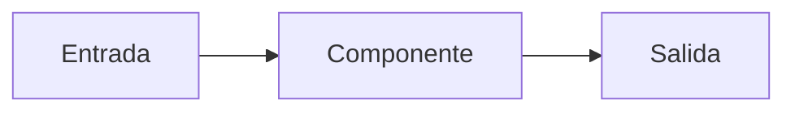
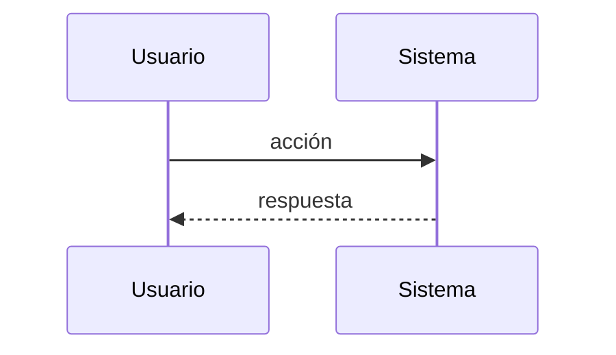

# Documento de Diseño: <Nombre de la feature>

## Visión general

<Resumen del enfoque técnico y cómo cumple los requisitos. Menciona las decisiones clave y las alternativas descartadas con su motivo.>

**Requisitos cubiertos:** <Req. 1, Req. 2, ...>

## Arquitectura

<Descripción de la estructura general y cómo encaja con el proyecto existente.>



## Flujo de datos

<Cómo viaja la información de punta a punta. Usa un diagrama de secuencia si hay varios actores.>



## Componentes e interfaces

### <Componente 1>

- **Responsabilidad:** <qué hace y qué no>.
- **Interfaz:** <funciones, endpoints, eventos o archivos que expone, con entradas y salidas>.
- **Requisitos que atiende:** <Req. N>.

### <Componente 2>

- **Responsabilidad:** ...
- **Interfaz:** ...
- **Requisitos que atiende:** ...

## Modelos de datos

<Entidades, campos, tipos, restricciones y relaciones.>

```text
<Entidad>
  campo: tipo   # descripción / restricción
```

## Manejo de errores

| Situación | Detección | Respuesta | Requisito |
|---|---|---|---|
| <error o caso límite> | <cómo se detecta> | <qué ocurre / qué ve el usuario> | <Req. N> |

## Estrategia de pruebas

- **Unitarias:** <qué se prueba y cómo>.
- **Integración:** <flujos que se validan de extremo a extremo>.
- **Casos clave:** <criterios de aceptación importantes que deben verificarse, con referencia al requisito>.

## Riesgos y decisiones pendientes

- <Riesgo o duda técnica y cómo mitigarla.>
