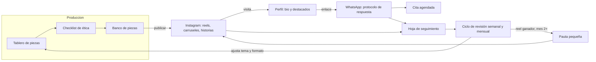
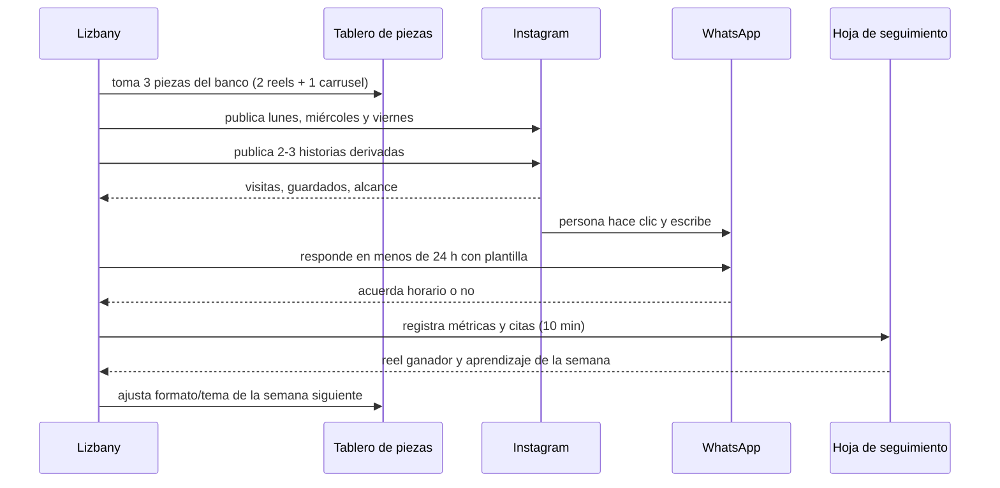
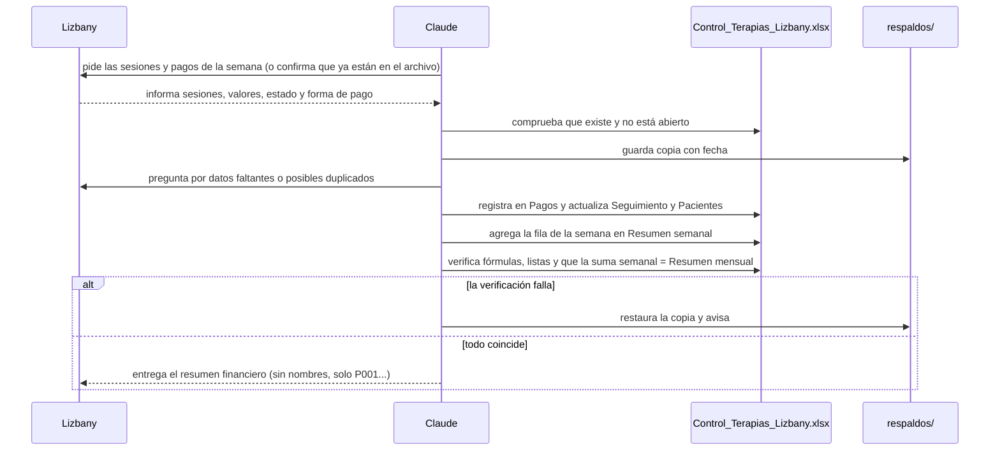
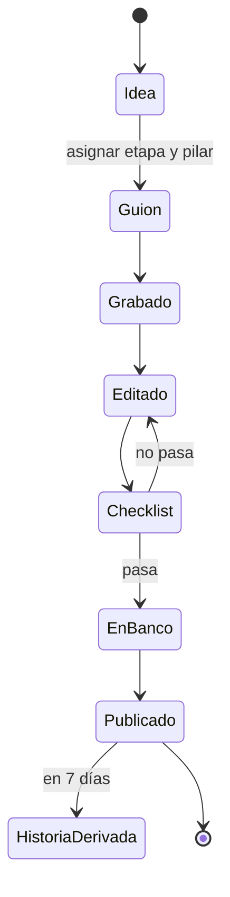

# Documento de Diseño: Plan de marketing en redes sociales (Lizbany Arango)

## Visión general

El plan es un **sistema operativo semanal** de bajo costo para una persona que produce sola. No necesita software propio: se apoya en Instagram, WhatsApp, una hoja de cálculo y unos pocos documentos de apoyo. Se organiza en seis piezas de trabajo: un **tablero de piezas** (calendario y banco), un **checklist de ética**, el **perfil convertidor** (bio y destacados), el **protocolo de WhatsApp**, la **hoja de seguimiento** y el **ciclo de revisión** (semanal y mensual), más un módulo opcional de **pauta**. A esto se suma un **control financiero semanal** que opera sobre el archivo de control de terapias que Lizbany ya usa y le entrega un resumen de sus entradas de capital.

Decisiones clave y alternativas descartadas:

- **Embudo de tres etapas con un papel por pieza** (Req. 2), en vez de publicar sin rol. Así cada publicación empuja hacia el WhatsApp y se puede medir qué etapa falla.
- **Tema foco por mes dentro de tres pilares** (Req. 3.3), en vez de un solo problema por mes (más recordación, pero se prueba menos variedad y un mes mal elegido se pierde) o mezcla pura de temas cada semana (más difícil de recordar y de revisar).
- **Hoja de cálculo como único registro** (Req. 8), en vez de herramientas de analítica o un CRM. Una persona sola necesita 10 minutos por semana, no un sistema. Se recomienda una hoja en la nube porque se llena desde el celular.
- **Checklist de ética como compuerta de publicación** (Req. 5.4), en vez de una guía que se lee una sola vez. Es la única forma de que la regla se cumpla bajo presión de tiempo.
- **Banco de piezas y grabación en tandas** (Req. 3.4 y 3.6) para proteger la constancia, que es el mayor riesgo para una persona sola.
- **Pauta solo sobre un reel ganador y con tope de gasto** (Req. 9), en vez de gastar desde el inicio: con menos de 500 seguidores se necesitan datos de qué contenido funciona antes de pagar por él.
- **Estructura de carpetas simple en el proyecto** (`marketing/`), reutilizando los materiales que ya existen, en vez de reorganizar lo producido.
- **Control financiero sobre el archivo existente** (`CUADRO CONTROL/Control_Terapias_Lizbany.xlsx`), con una hoja nueva "Resumen semanal" dentro del mismo archivo, en vez de crear un archivo financiero aparte o mezclar los pagos con la hoja de seguimiento de marketing. Un solo origen de datos evita duplicar información, y mantener los datos de pacientes fuera de la hoja de marketing y del repositorio protege su privacidad (Req. 10.12). El resumen entregado usa identificadores (P001...) y no nombres.
- **Actualizar con respaldo y verificación**: antes de tocar el archivo se guarda una copia y después se comprueba que fórmulas y listas desplegables siguen intactas, porque las librerías que editan Excel pueden perder funciones del archivo al guardar (ver Riesgos).

**Requisitos cubiertos:** Req. 1 a 10.

## Arquitectura

Estructura de trabajo dentro del proyecto (se añade una carpeta, lo demás ya existe):

```
MARCA PERSONAL AMOR/
├── specs/plan-marketing-redes/     # esta spec
├── marketing/                      # NUEVO: documentos operativos del plan
│   ├── checklist-etica.md          # compuerta de publicación
│   ├── plantillas-whatsapp.md      # respuestas tipo y protocolo de crisis
│   ├── calendario-12-semanas.md    # semanas, días, tema foco, etapa por pieza
│   └── guia-perfil.md              # bio y destacados
├── REELS FINALES/, VIDEOS/         # material ya producido (se reutiliza)
├── IDEAS PARA REELS #1.docx, IDEAS CARRUSEL #1/, PUBLICACIÓN 1-4.*
├── prompt_edicion_reel_lizbany.md  # base de edición de reels
├── SKIILS/                         # skills de apoyo (opcionales)
├── CUADRO CONTROL/                 # DATOS SENSIBLES: fuera de git
│   ├── Control_Terapias_Lizbany.xlsx   # hojas Pacientes, Pagos, Seguimiento, Resumen mensual + Resumen semanal (nueva)
│   └── respaldos/                  # copias con fecha antes de cada actualización
└── web-lizbany-arango/             # la web (no se modifica)
```

La **hoja de seguimiento** de marketing vive aparte (hoja de cálculo en la nube), con enlace guardado en `marketing/calendario-12-semanas.md`. No comparte datos con el control de terapias.



## Flujo de datos

**Ciclo de una semana:**



**Ciclo financiero semanal (cada lunes, semana de lunes a domingo):**



**Ciclo de vida de una pieza (estados):**



## Componentes e interfaces

### Tablero de piezas (calendario y banco)
- **Responsabilidad:** saber qué se publica cada día, con qué etapa y pilar, y garantizar un banco mínimo de piezas. No produce las piezas.
- **Interfaz:** `calendario-12-semanas.md` (12 semanas × 3 publicaciones + historias; tema foco por mes) y una pestaña "Piezas" en la hoja (modelo en "Modelos de datos"). Entradas: ideas de `IDEAS PARA REELS #1.docx`, `IDEAS CARRUSEL #1/` y `REELS FINALES/`. Salida: la lista de piezas para publicar.
- **Reglas:** al menos la mitad de las piezas del mes son del tema foco y hay al menos una de cada uno de los otros dos pilares. Una pieza sin etapa asignada no avanza.
- **Requisitos que atiende:** Req. 2.1, 2.5, 3.1 a 3.6, 4.1 a 4.3.

### Checklist de ética
- **Responsabilidad:** compuerta que toda pieza (y toda pieza impulsada) debe pasar antes de publicarse.
- **Interfaz:** `checklist-etica.md`, con puntos de sí/no. Resultado registrado en la pieza (campo `checklist_ok`). Los puntos son:
  1. Sin diagnóstico, promesa de cura ni resultado garantizado.
  2. Sin testimonio ni caso de paciente (real o disfrazado).
  3. Sin lenguaje que invite al autodiagnóstico.
  4. Tono acogedor y no alarmista.
  5. Etapa asignada y llamado a la acción coherente con ella.
  6. Paleta y tipografías de marca; mensaje de WhatsApp correcto si hay CTA.
  7. Subtítulos y texto legible (contraste de al menos 4.5:1).
  8. Revisión de publicidad del Colegio de Psicólogos hecha y sin restricciones pendientes.
- **Requisitos que atiende:** Req. 5.1 a 5.4, 5.6, 5.7, 6.1, 6.2, 6.3 y los no funcionales de accesibilidad.

### Perfil convertidor (bio y destacados)
- **Responsabilidad:** que quien llega desde un reel entienda en segundos a quién ayuda y cómo agendar.
- **Interfaz:** `guia-perfil.md` con el texto de la bio (una frase de a quién ayuda y qué enfoque usa) y el enlace de WhatsApp con "Hola Liz, quiero agendar una cita."; 4 destacados: cómo son las sesiones, precios ($100.000 COP por sesión; $350.000 COP por 4), cómo agendar y preguntas frecuentes. Incluye el aviso de que no reemplaza urgencias.
- **Requisitos que atiende:** Req. 5.5, 6.2, 7.1 a 7.3.

### Protocolo de WhatsApp
- **Responsabilidad:** convertir conversaciones en citas de forma cálida, segura y en menos de 24 horas.
- **Interfaz:** `plantillas-whatsapp.md` con: (a) respuesta a conversación nueva que propone horario, (b) recordatorio de seguimiento, (c) respuesta ante crisis que indica la línea de emergencia local y no aborda el caso, (d) respuesta tipo a comentarios negativos o de autodiagnóstico. Regla: no pedir ni aceptar datos clínicos antes de la consulta.
- **Requisitos que atiende:** Req. 7.4 a 7.7.

### Hoja de seguimiento
- **Responsabilidad:** único registro de piezas, métricas, pauta y decisiones. Sin datos personales de quienes escriben.
- **Interfaz:** hoja de cálculo con pestañas **Piezas**, **Semanas**, **Meses** y **Pauta**. El registro semanal se diseña para completarse en 10 minutos o menos (todas las métricas salen de las estadísticas de Instagram y del conteo de conversaciones).
- **Requisitos que atiende:** Req. 1.2, 1.3, 1.5, 2.1, 8.1, 8.2, 8.5, 8.6, 9.5.

### Ciclo de revisión
- **Responsabilidad:** convertir los datos en decisiones.
- **Interfaz:**
  - *Semanal:* identificar el reel de mayor alcance y planear repetir su formato o tema (Req. 8.3).
  - *Semana 4:* comparar la tasa real conversación→cita con la hipótesis de 1 de 4 y recalcular la meta semanal de conversaciones (Req. 1.3).
  - *Mensual:* revisar el avance frente a la meta y fijar el tema foco siguiente (Req. 8.4).
  - *Semana 8:* si hay menos de 3 citas, revisión extraordinaria de bio, destacados, plantilla y ganchos antes de la semana 9 (Req. 1.4).
  - *Semana 12:* decidir por escrito si el plan se repite, se ajusta o se amplía (Req. 1.5).
- **Requisitos que atiende:** Req. 1.3 a 1.5, 8.3, 8.4.

### Pauta pequeña (opcional)
- **Responsabilidad:** impulsar un reel ganador sin gastar a ciegas.
- **Interfaz:** pestaña **Pauta** con el tope de gasto (definido por escrito antes de activar), el reel elegido, el gasto, el alcance y las conversaciones nuevas durante esos días. Regla: un reel es "ganador" si su alcance es al menos el doble de la mediana de alcance de los reels del mes anterior. Solo desde el mes 2. Si no hay reel ganador, no se activa. El reel impulsado debe haber pasado el checklist de ética. Destino: perfil o WhatsApp.
- **Requisitos que atiende:** Req. 9.1 a 9.5.

### Control financiero de terapias
- **Responsabilidad:** mantener actualizado el control de terapias de Lizbany y entregarle cada semana el resumen de las entradas de capital por sesiones. No es contabilidad formal ni cobra a los pacientes.
- **Interfaz:**
  - *Entrada:* sesiones y pagos de la semana informados por Lizbany (o ya registrados por ella en el archivo).
  - *Base:* `CUADRO CONTROL/Control_Terapias_Lizbany.xlsx`. Hojas existentes: **Pacientes** (ID, paciente, primera consulta, modalidad, estado, notas), **Pagos** (fecha, paciente, tipo, modalidad, valor cobrado, valor recibido, estado de pago, forma de pago, observaciones), **Seguimiento** (consultas incluidas, realizadas y pendientes, total plan, total pagado, saldo, última y próxima consulta) y **Resumen mensual** (ingresos recibidos, cobros, saldo, activos, consultas del mes).
  - *Salida:* una fila nueva en la hoja **Resumen semanal** (calculada con `SUMIFS` por rango de fechas, para que siga viva) y el informe entregado a Lizbany con: sesiones realizadas (total y por tipo), cobros registrados, ingresos recibidos, pendiente por cobrar, ingresos por forma de pago, acumulado del mes y variación frente a la semana anterior. Los saldos pendientes se muestran por ID de paciente.
- **Reglas:** el ingreso se calcula con "Valor recibido" y se asigna a la semana de la fecha de la fila; un pago posterior entra como fila nueva con su fecha de recepción; un abono nunca se asume como pago total; si falta o es dudoso un dato, se pregunta y no se inventa; un registro con misma fecha, paciente y valor requiere confirmación.
- **Seguridad de los datos:** copia con fecha antes de cada actualización (se conservan las 4 más recientes), verificación posterior y restauración automática si algo no coincide. La carpeta `CUADRO CONTROL/` se excluye de git.
- **Requisitos que atiende:** Req. 10.1 a 10.12 y el requisito no funcional de privacidad.

### Herramientas de apoyo (opcionales)
- **Responsabilidad:** acelerar la producción sin cambiar el plan. De los skills de `SKIILS/`, los más útiles son `hook-generator`, `story-reel-scriptwriter`, `caption-writer`, `monthly-content-planner` y `performance-analyst`. Todos leen un perfil de marca (`brand-profile.md`) creado una sola vez.
- **Interfaz:** se instalan copiando el `.skill` (es un zip) a `~/.claude/skills/`. Los textos que generen pasan siempre por el checklist de ética.
- **Requisitos que atiende:** apoya Req. 2, 3, 4 y 8; no cumple por sí solo ningún requisito.

## Modelos de datos

Los datos de marketing se guardan en la hoja de seguimiento (sin datos personales de pacientes). Los datos financieros viven solo en el control de terapias, con la hoja nueva descrita al final de esta sección.

```text
Pieza                       # pestaña Piezas
  id: texto                 # P-001...
  semana: entero (1-12)
  fecha_publicación: fecha
  formato: reel | carrusel | historia
  etapa: atraer | confiar | agendar     # obligatoria (Req. 2.1)
  pilar: ansiedad | autoexigencia | relaciones_cambios
  tema_foco_del_mes: sí/no
  gancho: texto             # primeros 3 segundos (reel)
  estado: idea | guion | grabado | editado | en_banco | publicado
  checklist_ok: sí/no       # obligatorio para publicar (Req. 5.4)
  derivada_de: id de pieza  # historia derivada de un reel (Req. 4.1)
  enlace: url
  motivo_si_falta: texto    # semana con menos de 3 publicaciones (Req. 3.5)

Semana                      # pestaña Semanas
  semana: entero (1-12)
  fecha_inicio: fecha
  publicaciones: entero     # meta: 2 reels + 1 carrusel
  historias: entero         # meta: 2-3
  alcance_reel_1, alcance_reel_2: entero
  guardados, compartidos: entero
  visitas_perfil, clics_whatsapp: entero
  conversaciones_nuevas: entero   # meta: 2-3
  citas_agendadas: entero
  reel_de_mayor_alcance: id de pieza
  aprendizaje, decisión_siguiente_semana: texto
  # cualquier métrica no disponible se anota "n/d" con su causa (Req. 8.5)

Mes                         # pestaña Meses
  mes: 1 | 2 | 3
  tema_foco: ansiedad | autoexigencia | relaciones_cambios
  citas_acumuladas, conversaciones_acumuladas: entero
  tasa_conversación_a_cita: decimal   # real, contra la hipótesis de 0.25
  mediana_alcance_reels: entero       # base para el "reel ganador" del mes siguiente
  decisión_tema_siguiente: texto

Pauta                       # pestaña Pauta
  tope_gasto_cop: entero    # definido por escrito antes de activar (Req. 9.2)
  pieza_impulsada: id de pieza
  gasto_cop, alcance_obtenido, conversaciones_en_esos_días: entero
```

Hoja nueva en `Control_Terapias_Lizbany.xlsx` (una fila por semana; las cifras salen de fórmulas sobre la hoja Pagos):

```text
Resumen semanal
  semana_inicio: fecha (lunes)
  semana_fin: fecha (domingo)
  sesiones_realizadas: entero
  sesiones_diagnóstica, sesiones_individual, sesiones_paquete: entero
  cobros_registrados_cop: entero      # suma de "Valor cobrado" de la semana
  ingresos_recibidos_cop: entero      # suma de "Valor recibido" de la semana
  pendiente_por_cobrar_cop: entero    # cobros_registrados - ingresos_recibidos
  ingresos_nequi_cop, ingresos_bancolombia_cop, ingresos_otras_cop: entero
  acumulado_mes_cop: entero
  variación_vs_semana_anterior_cop: entero  (y su porcentaje)
  observaciones: texto                # "sin movimientos" si la semana está en cero
```

## Manejo de errores

| Situación | Detección | Respuesta | Requisito |
|---|---|---|---|
| Semana con menos de 3 publicaciones | Conteo semanal en la hoja | Anotar el motivo y usar el banco la semana siguiente | 3.5 |
| El banco baja de 3 piezas | Conteo de piezas en estado `en_banco` | Dedicar la siguiente sesión a una tanda de grabación | 3.4, 3.6 |
| Pieza sin etapa asignada | Campo `etapa` vacío | No se publica hasta asignarla | 2.1, 2.5 |
| Pieza no pasa el checklist de ética | `checklist_ok` = no | Vuelve a edición; no se publica ni se impulsa | 5.4, 9.4 |
| Revisión del Colegio de Psicólogos trae restricciones | Registro de la revisión | Se actualiza el checklist y se revisa el banco antes de publicar | 5.6, 5.7 |
| Cuenta de Instagram no es profesional (sin estadísticas) | Falta de métricas en la semana 1 | Convertirla a profesional antes de la semana 1 | Supuestos, 8.5 |
| Métrica no disponible | Celda vacía al cierre de semana | Escribir "n/d" y la causa | 8.5 |
| Poca conversión: menos de 3 citas al cierre de la semana 8 | Pestaña Meses | Revisión extraordinaria antes de la semana 9 | 1.4 |
| Tasa real de conversión distinta a 1 de 4 | Semana 4 | Recalcular conversaciones semanales necesarias | 1.3 |
| Persona escribe en crisis | Contenido del mensaje | Respuesta breve con la línea de emergencia local; no se aborda por mensajes | 7.6 |
| Comentario negativo o de autodiagnóstico | Lectura de comentarios | Una respuesta breve y amable; no se borra un simple desacuerdo | 7.7 |
| Mensaje en WhatsApp sin respuesta en 24 h | Revisión diaria del WhatsApp | Contestar de inmediato con la plantilla y anotar el retraso en la semana | 7.4 |
| No hay reel ganador en el mes 2 | Comparar con la mediana | No se activa pauta; se sigue orgánico | 9.3 |
| Tope de gasto de pauta agotado | Pestaña Pauta | Se detiene la pauta | 9.2 |
| Falta un dato de una sesión o de un pago | Campo vacío o dudoso al registrar | Se pregunta a Lizbany; no se inventa. Un abono se registra como abono | 10.4 |
| Posible registro duplicado | Misma fecha, paciente y valor en Pagos | Se pide confirmación antes de agregarlo | 10.5 |
| Semana sin sesiones ni pagos | Suma de la semana en cero | Se registra la semana en ceros con "sin movimientos" y se entrega el resumen | 10.9 |
| La suma semanal no coincide con el Resumen mensual, o se rompen fórmulas o listas | Verificación posterior al guardado | Se restaura la copia de respaldo y se avisa a Lizbany | 10.10 |
| Archivo no encontrado o abierto en otro programa | Error al abrir o guardar | No se modifica nada; se avisa a Lizbany | 10.11 |
| Datos de pacientes a punto de entrar al repositorio de git | `git status` muestra `CUADRO CONTROL/` | La carpeta está en `.gitignore` y no se agrega | 10.12 |

## Estrategia de pruebas

El plan no se prueba con código, sino con **verificaciones de aceptación** que se ejecutan antes y durante el plan:

- **Prueba de arranque (antes de la semana 1):**
  - Hacer clic en el enlace de la bio desde un celular y comprobar que abre WhatsApp con el mensaje "Hola Liz, quiero agendar una cita." (Req. 6.2, 7.1).
  - Comprobar que existen la bio, los 4 destacados con precios y el aviso de urgencias (Req. 5.5, 7.1 a 7.3).
  - Comprobar que el banco tiene al menos 3 piezas que pasaron el checklist (Req. 3.4).
  - Comprobar que la revisión del Colegio de Psicólogos quedó registrada (Req. 5.6).
- **Auditoría de piezas (cada semana):** tomar las piezas publicadas y verificar que cada una tiene etapa asignada, checklist aprobado y la identidad de marca (Req. 2.1, 5.4, 6.1).
- **Prueba del registro semanal:** cronometrar el llenado de la hoja durante las primeras 2 semanas; si supera 10 minutos, simplificar la hoja (Req. 8.2).
- **Prueba del camino a la cita:** pedir a 2 personas cercanas que sigan el recorrido reel → perfil → WhatsApp y comprobar que llegan sin confundirse y que se les responde con la plantilla en menos de 24 horas (Req. 7.1 a 7.4).
- **Prueba del control financiero (primera corrida y cada semana):**
  - Comparar a mano la suma de "Valor recibido" de la semana en Pagos con el "ingresos_recibidos_cop" del resumen (Req. 10.7).
  - Comprobar que la suma de los ingresos semanales del mes coincide con "Ingresos recibidos en el mes" de Resumen mensual (Req. 10.10).
  - Comprobar que la lista desplegable de "Estado pago" y las fórmulas de Seguimiento siguen funcionando tras guardar (Req. 10.10).
  - Probar un registro duplicado y uno con un dato faltante, y comprobar que se pide confirmación o el dato (Req. 10.4, 10.5).
  - Comprobar que el resumen entregado no contiene nombres y que `git status` no muestra `CUADRO CONTROL/` (Req. 10.12).
- **Casos clave de aceptación:**
  - Semana 4: la tasa real de conversación→cita está calculada (Req. 1.3).
  - Semana 8: si hay menos de 3 citas, existe una revisión extraordinaria registrada (Req. 1.4).
  - Semana 12: hay una decisión escrita sobre el plan (Req. 1.5).
  - Pauta (si se usa): tope definido por escrito y checklist aprobado antes de activar (Req. 9.2, 9.4).

## Riesgos y decisiones pendientes

- **Constancia de una persona sola:** el mayor riesgo. Mitigación: banco de piezas, tandas de grabación y reutilización de cada reel (Req. 3, 4).
- **Resultados lentos con una cuenta nueva:** el mes 1 puede dar pocas conversaciones aunque el plan funcione. Se evalúa por tendencia mensual y con la revisión de la semana 4.
- **Ética y normativa:** el checklist depende de la revisión del Colegio de Psicólogos, que aún está pendiente. Hasta entonces, el criterio es el más conservador.
- **Hipótesis de conversión sin validar** (1 de cada 4): la meta de 2 a 3 conversaciones semanales cambia si la tasa real es distinta.
- **Capacidad de respuesta en WhatsApp:** responder en menos de 24 horas puede ser difícil en días con consulta. Pendiente definir quién responde.
- **Valores propuestos por el documento y ajustables:** el criterio de "reel ganador" (el doble de la mediana) y "al menos la mitad" de piezas del tema foco.
- **Editar Excel puede dañar el archivo:** al guardar con una librería de Python (`openpyxl`), se pierden las extensiones de validación de datos y otras funciones que no soporta. Mitigación: copia de respaldo previa, verificación posterior y restauración automática; probar primero sobre una copia.
- **Fórmulas con datos fijos en el archivo actual:** en Seguimiento el "Total plan" de un paciente con consultas individuales está en 0, lo que hace salir su saldo negativo; en Resumen mensual hay un saldo atado al nombre de un paciente y un texto con el mes escrito a mano. Se corrigen con la aprobación de Lizbany antes de confiar en el resumen.
- **Ingresos por fecha de la fila:** como Pagos tiene una sola fecha, un pago que llega después se registra como fila nueva; si no se hace, el ingreso queda en la semana equivocada.
- **Precios que no coinciden:** los del archivo de control difieren de los del documento de marca, y los destacados (Req. 7.3) los publican. Deben aclararse antes de la prueba de arranque.
- **Datos sensibles en git:** `CUADRO CONTROL/` hoy aparece como carpeta sin seguimiento del repositorio; hay que ignorarla antes de cualquier commit.
- **Decisiones pendientes de Lizbany:** fecha de inicio, tope de gasto de la pauta, si la hoja será en la nube o local, precios vigentes, y el día y la forma de entrega de los datos semanales del control financiero.
