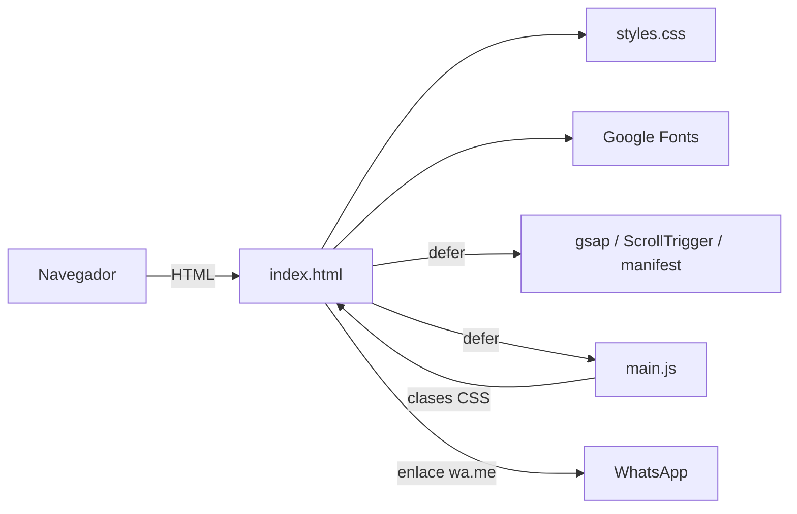
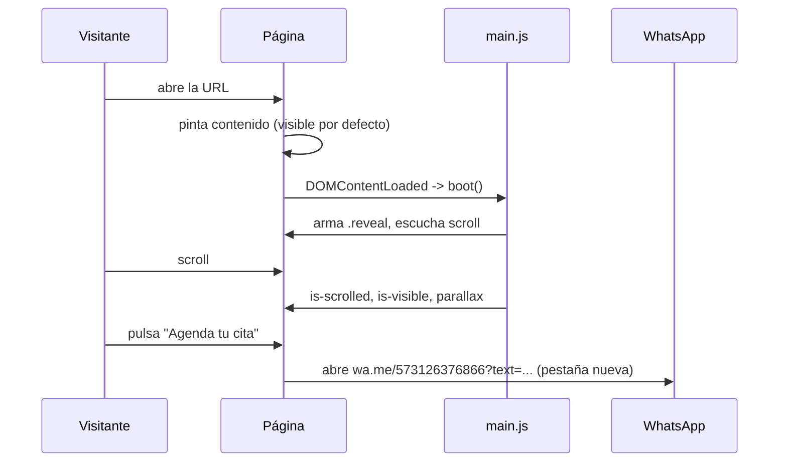

# Documento de Diseño: Web de Lizbany Arango (landing de una página)

## Visión general

Landing estática de una sola página: un `index.html` semántico, una hoja de estilos (`styles.css`) y un script sin módulos (`main.js`) que solo añade mejoras progresivas (barra sólida, scroll con margen, aparición de elementos, parallax suave). El contenido es visible por defecto; el JS nunca es necesario para leer ni para contactar.

Decisiones clave:
- **Sin build ni framework.** Se despliega copiando archivos a Apache/LiteSpeed. Reduce mantenimiento para una página de contenido fijo (Req. 8, no funcionales).
- **El contenido vive en el HTML**, no se renderiza desde JS. Mejor SEO, funciona sin JS y sin parpadeos (Req. 7.2, 8.1). `lib/manifest.js` (`window.__BRAND__`) hoy duplica los textos y **ningún script lo consume**; ver "Riesgos".
- **Mejora progresiva de las animaciones:** el CSS deja `.reveal` visible y solo oculta elementos que el JS "arma" con `reveal-armed`. Si el JS falla, nada queda oculto.
- **CTA único hacia WhatsApp** con enlace `wa.me` y mensaje precargado, sin backend ni formulario (Req. 5).

**Requisitos cubiertos:** Req. 1 a 8.

## Arquitectura

```
web-lizbany-arango/
├── index.html          # estructura y contenido
├── styles.css?v=...    # tokens, base, secciones, efectos, responsive
├── main.js?v=...       # IIFE: nav, anclas, reveals, parallax
├── lib/
│   ├── gsap.min.js, ScrollTrigger.min.js   # cargados y registrados, hoy sin animaciones propias
│   └── manifest.js     # datos de marca (window.__BRAND__), sin consumidores
├── assets/
│   ├── img/            # hero-lizbany.webp, logo-mark.webp, favicon.png
│   ├── photos/source/  # originales
│   └── credits.json    # autoría de imágenes
└── .htaccess           # caché, MIME, gzip, cabeceras
```



Orden de secciones en `<main>`: hero → enfoque → servicios → compromiso → reflexiones → modalidad → contacto, más `footer`. La barra superior es `header.nav` fija.

## Flujo de datos

No hay datos de usuario ni estado persistente. El único "flujo" es la inicialización y el contacto:



## Componentes e interfaces

### Barra de navegación (`header.nav[data-nav]`)
- **Responsabilidad:** marca, enlaces a secciones y CTA; se solidifica al hacer scroll.
- **Interfaz:** `initNav()` añade/quita `is-scrolled` cuando `scrollY > 12`. Enlaces `#enfoque`, `#servicios`, `#reflexiones`, `#contacto`.
- **Requisitos:** Req. 2.1, 2.3.

### Anclas con margen (`initAnchors`)
- **Responsabilidad:** interceptar clics en `a[href^="#"]` y desplazar con margen de 84 px (coincide con `--nav-h`).
- **Interfaz:** `window.scrollTo({top, behavior})` con `behavior:"auto"` si `prefers-reduced-motion`. Ignora `#` vacío o destinos inexistentes.
- **Requisitos:** Req. 1.3, 2.2, 2.5.

### Enlace "Saltar al contacto"
- **Responsabilidad:** primer elemento enfocable (`a.skip-link` → `#contacto`).
- **Requisitos:** Req. 2.4.

### Hero (`section.hero`)
- **Responsabilidad:** imagen de marca, kicker, titular (`h1`), subtítulo y dos CTA.
- **Interfaz:** `<link rel="preload" as="image" fetchpriority="high">` + ``; `.hero-scrim` garantiza legibilidad.
- **Requisitos:** Req. 1.1, 1.2, 1.4, 8.2.

### Secciones de contenido
- **Enfoque / Compromiso / Modalidad:** layouts `split` y bloque de cita; listas con `check-list`.
- **Servicios:** `.cards-grid` con cuatro `article.card` (icono SVG inline con `aria-hidden`, `h3`, `p`).
- **Reflexiones:** `.reflexiones-grid` con tres `figure.reflexion-card` y `figcaption` con la fuente.
- **Contacto:** botón WhatsApp, enlaces de Instagram y correo (`mailto:`), `p.disclaimer` de urgencias.
- **Requisitos:** Req. 3, 4, 5.

### Reveals (`initReveals`)
- **Responsabilidad:** aparición al entrar en pantalla.
- **Interfaz:** si hay `IntersectionObserver`, añade `reveal-armed` a todos los `.reveal` y `is-visible` al intersectar (umbral 0.01). Red de seguridad a los 6 s; el hero se revela a los ~80 ms. Sin soporte → no hace nada (contenido visible). CSS extra `@media (scripting: none)` fuerza visibilidad.
- **Requisitos:** Req. 7.1, 7.2, 7.3.

### Parallax botánico (`initParallax`)
- **Responsabilidad:** mover `.botanical-line` con `translate3d`, limitado a ±24 px, con `requestAnimationFrame`.
- **Requisitos:** Req. 7.5.

### Arranque (`boot` + `safe`)
- **Responsabilidad:** ejecutar cada init dentro de `try/catch` para que un fallo no rompa a los demás; registrar `ScrollTrigger` si existe y marcar `html.is-ready`.
- **Requisitos:** Req. 7.2.

### Capa de estilos (`styles.css`)
- **Estructura:** 1 tokens, 2 reset/base, secciones, 7 efectos, 8 responsive.
- **Tokens:** colores `--bg #F7F5EE`, `--ink #2E2A22`, `--sage-*`, `--terracotta*`; tipografías Fraunces (títulos), Lora (cuerpo), Work Sans (UI); `--nav-h: 84px`.
- **Responsive:** mobile-first con `min-width` en 540, 720, 960 y 1280 px; `overflow-x: clip` en `html` y `body`.
- **Requisitos:** Req. 6.1 a 6.3, 8.5.

### Despliegue (`.htaccess`)
- HTML/CSS/JS/JSON: `no-cache, must-revalidate`; imágenes y fuentes: cache largo; MIME correctos, gzip y cabeceras mínimas de seguridad. Los recursos con `?v=AAAAMMDD` en `index.html` rompen la caché al desplegar cambios.
- **Requisitos:** Req. 8.4.

## Modelos de datos

No hay base de datos. Los datos son contenido estático:

```text
window.__BRAND__ (lib/manifest.js)
  name, title, handle, email, phone      # strings
  whatsappNumber: "573126376866"
  whatsappMessage: "Hola Liz, quiero agendar una cita."
  heroKicker, heroQuoteLead, heroQuoteEmphasis, heroSub
  enfoque: { kicker, title, body }
  servicios: [ { title, body } x4 ]
  ... reflexiones, modalidad, contacto

assets/credits.json
  images: [ { file, source, owner, notes } ]
```

## Manejo de errores

| Situación | Detección | Respuesta | Requisito |
|---|---|---|---|
| JS desactivado | `@media (scripting: none)` | `.reveal` visible, sin animación | 7.2 |
| Sin `IntersectionObserver` | `"IntersectionObserver" in window` | No se arma nada; todo visible | 7.2 |
| Falla una inicialización | `try/catch` en `safe()` | Aviso en consola; las demás siguen | 7.2 |
| Elemento sin revelar | Temporizador de 6 s | Se marca `is-visible` si está en pantalla | 7.3 |
| Ancla a destino inexistente | `querySelector` devuelve `null` | Se deja el comportamiento nativo | 2.2 |
| Fallan las fuentes de Google | `font-display: swap` + fuentes de respaldo (`Georgia`, `Segoe UI`) | Texto legible con tipografía del sistema | 8 |
| Falla la imagen del hero | Texto alternativo + fondo del tema | Texto sigue legible | 1.4 |
| WhatsApp no instalado | `wa.me` abre WhatsApp Web | Funciona desde el navegador | 5.2 |

## Estrategia de pruebas

No hay tests automatizados ni build, así que la verificación es manual y con auditorías:

- **Estructurales (script o inspección):** un solo `h1`; `lang="es"`; todos los enlaces `target="_blank"` con `rel="noopener"`; las 4 URLs de WhatsApp idénticas; imágenes con `width`/`height` y `alt` (o `aria-hidden`).
- **Navegador en 3 anchos (360, 768, 1280 px):** sin scroll horizontal, nav utilizable, tarjetas en columnas esperadas (Req. 6.1, 6.2).
- **Área táctil (Req. 6.3):** a 360 px, medir con las herramientas de desarrollo que `.btn` mide ≥ 44 px de alto y que los enlaces de navegación y contacto miden ≥ 24 × 24 px.
- **Interacción:** clic en cada ancla (margen de 84 px), barra sólida tras 12 px, CTA abre WhatsApp con el mensaje (Req. 2, 5).
- **Degradación:** desactivar JS, y emular `prefers-reduced-motion: reduce`, y comprobar que todo se ve y que no hay animaciones (Req. 7).
- **Auditoría Lighthouse (móvil):** rendimiento, accesibilidad ≥ 90, SEO; revisar contraste ≥ 4.5:1 (Req. 8).
- **Despliegue:** revisar cabeceras de caché de HTML, CSS, JS e imágenes en el servidor real.

## Riesgos y decisiones pendientes

- **`manifest.js` duplica el contenido y no se usa.** Opciones: eliminarlo, o usarlo como fuente única que alimente el HTML. Hoy cambiar un texto o el teléfono exige editar varios sitios. Depende de la pregunta abierta de los requisitos.
- **Brecha con Req. 7.4:** `main.js` y el CSS solo desactivan el scroll suave y el `scroll-cue` con `prefers-reduced-motion`; los reveals (`opacity`/`transform`) siguen animándose. Hace falta una regla CSS `@media (prefers-reduced-motion: reduce)` que anule la transición de `.reveal`, o evitar armarlos en `initReveals`.
- **GSAP y ScrollTrigger se descargan sin usarse** (peso innecesario). Quitarlos o aprovecharlos en una animación real.
- **Falta de metadatos para compartir** (Open Graph, `canonical`) y de política de privacidad: pendientes de decisión (preguntas abiertas de requisitos).
- **Contraste:** `--ink-mute #776472` sobre `--bg` debe verificarse contra 4.5:1.
- **Doble desplazamiento suave:** `html { scroll-behavior: smooth }` y `scrollTo({behavior:"smooth"})` coexisten; funciona, pero conviene dejar solo uno.
